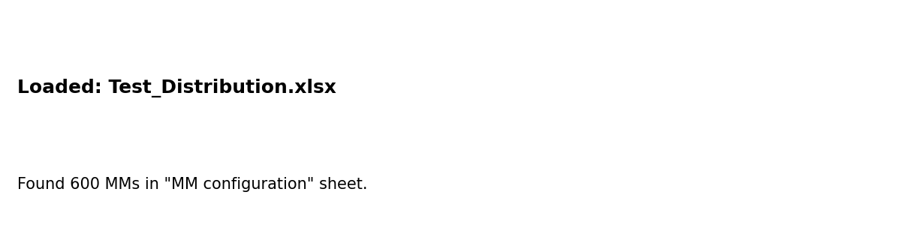
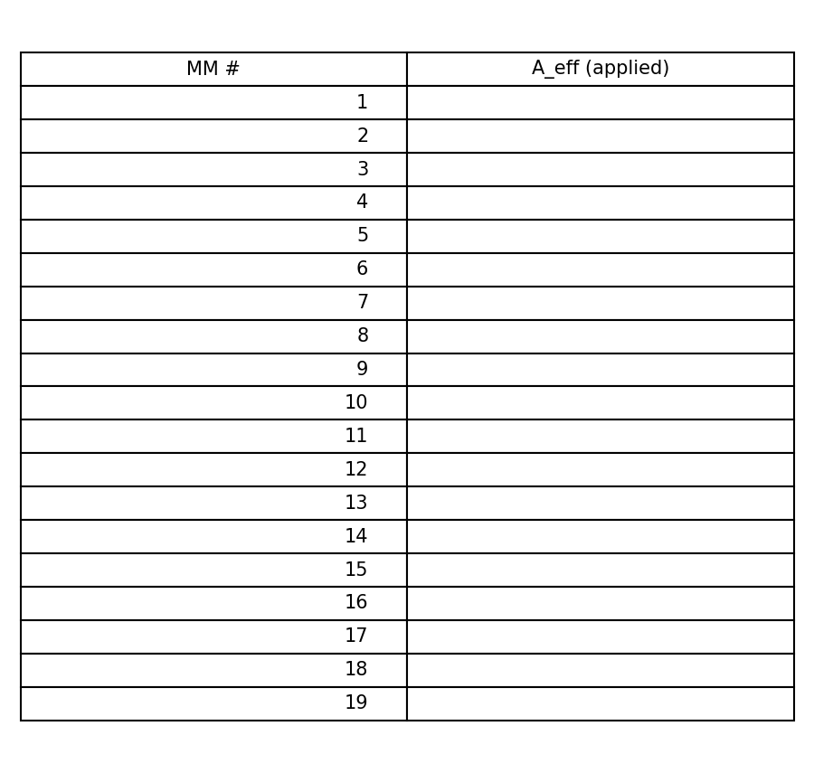
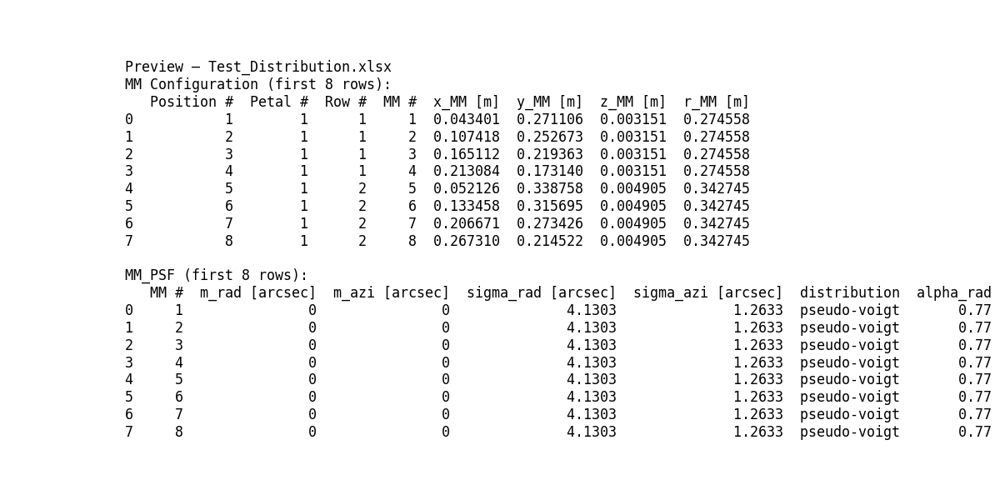
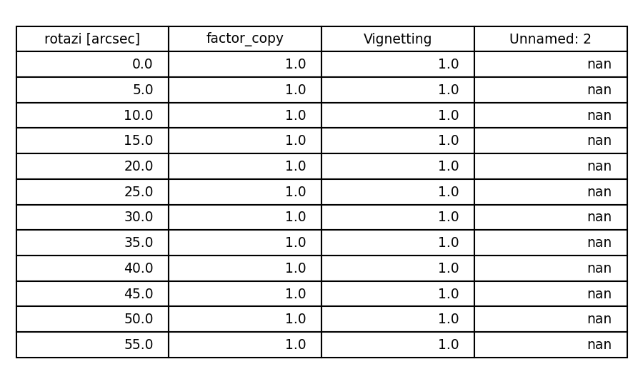

GUI Guide — A_eff & Vignetting Export
=====================================

This short guide explains the GUI behavior relevant to `A_eff` handling and
vignetting export-time copying.

Overview
--------
- The GUI is implemented in `gui_distributions.py` and is started by running
  `python3 gui_distributions.py`.
- Key tabs:
  - `Load File` — open an Excel workbook containing MM configuration and
    preset tables.
  - `MM Configuration` — select which mirror modules (MMs) to include.
  - `A_eff` — choose a standard preset or a fixed value and apply per-MM
    effective-area weights.
  - `Preview / Export` — inspect generated tables and export/back-fill the
    workbook.

A_eff workflow
--------------
- A_eff presets are read from the `A_eff` sheet. The sheet is expected to
  contain MM numbers in column A and a canonical weight column in column B.
- Standard presets in the `A_eff` sheet may provide `Values` expressions
  (column D/E layout or detected headers). Supported expression forms:
  - `J` — copy value from column letter `J` for that MM row.
  - `gaussian(J, mean_expr, sigma_expr)` or `gaussian(J, sigma_expr)` —
    sample per-MM around the column value.
  - `J+gaussian(0,20%*J)` — additive gaussian around the column value.
- In the GUI `A_eff` tab you may:
  - Select `Fixed Value` and enter a single numeric A_eff to apply to the
    selected MMs.
  - Select a `Standard Distribution` preset and apply it; the UI evaluates
    the preset per-MM and populates `self.aeff_weights`.
- Applying A_eff sets a transient flag `aeff_pending_export`. The actual
  workbook is written only during the Export step.

Vignetting export-time copy
---------------------------
- The A_eff tab exposes a checkbox: `Apply vignetting factors when exporting`.
- When checked and when a standard A_eff preset is selected, the export
  routine will attempt to copy the chosen preset column from the `Vignetting
  rotazi` and `Vignetting rotrad` sheets into column B of those sheets.

How the copy is matched:
- The code first accepts a direct column-letter preset (e.g. `K`). If the
  preset string matches `[A-Za-z]{1,3}` it is interpreted as a column.
- Otherwise the header row (row 1) of the vignetting sheet is scanned and
  headers are normalized (lowercased, whitespace removed). The preset string
  is normalized similarly and used as a substring match against headers.
- If a matching source column is found, values from that column are copied
  to column B for every data row (rows 2..N). If no match is found the
  sheet is skipped (non-fatal).

Export details
--------------
- Export behavior (from `Preview / Export` tab):
  - `Overwrite loaded file` updates the loaded workbook in-place.
  - `Save as new file` writes to the chosen path; when overwriting an
    existing file the original workbook is loaded first to preserve styles.
- Per-data-type generated dataframes are written to their configured sheet
  names; existing columns are preserved and new ones appended.
- If `A_eff` edits are pending they are written to the `A_eff` sheet with
  MM # in column A and the applied effective area in column B.
- Vignetting column copy (if enabled) runs after A_eff writes and before
  the workbook is saved; failures during copy are non-fatal and reported as
  warnings.

Notes & Troubleshooting
-----------------------
- The GUI is tolerant to several workbook layouts (headers in different
  columns, missing sigma/alpha cells in presets) and tries to infer the
  correct interpretation — when in doubt inspect the `A_eff` and
  `Vignetting` sheets and prefer using explicit column letters if your
  workbook has unusual headers.
- If a particular MM does not get an A_eff value during export, ensure you
  applied a preset or fixed value for that MM (the export will raise an
  error when missing values are encountered).

Files of interest
-----------------
- `gui_distributions.py` — main GUI implementation (handlers and export
  logic).
- `main.py` — command-line runner and data-processing entrypoint.
- `DOCS_SUMMARY.md` — repository docs map (see root).

If you want, I can expand this into a longer user guide with screenshots and
step-by-step examples from `Distributions/Test_Distribution.xlsx`.

Examples and suggested screenshots
---------------------------------
Below are short, copyable examples that walk through a common workflow. I
include suggested screenshot filenames (place captured PNGs in `Figures/`)
so you can quickly assemble illustrated documentation.

1) Launch GUI and load workbook

   - Command:

     ```bash
     python3 gui_distributions.py
     ```

   - In the GUI: Click `Load Excel File` and choose `Distributions/Test_Distribution.xlsx`.
   - Suggested screenshot: `Figures/gui_load.png` (capture the Load tab after file load).

2) Apply a standard A_eff preset to selected MMs

   - In `MM Configuration` select a few MMs (or `Select All`).
   - In `A_eff` choose `Standard Distribution`, pick a preset (e.g. `1 keV`) and click
     `Apply to Selected MMs`.
   - The GUI will show a confirmation modal indicating pending export.
   - Suggested screenshot: `Figures/aeff_apply.png` (A_eff tab showing preset and applied dialog).

   Example Values expressions supported in `A_eff` sheet:
   - `J` — copy from column `J` for that MM
   - `gaussian(J, 0, 20%*J)` — sample around column `J` with sigma = 20% of J
   - `L+gaussian(0,5%*L)` — additive gaussian noise around column `L`

3) Enable vignetting copy and export

   - In `A_eff` check `Apply vignetting factors when exporting` (works for standard presets).
   - Switch to `Preview / Export`, choose `Save as new file` and pick a filename.
   - Click `Export to Excel`. The workbook will be updated and the chosen
     vignetting column (matched by header or explicit column letter) will be
     copied into column B of `Vignetting rotazi` and `Vignetting rotrad`.
   - Suggested screenshot: `Figures/export_dialog.png` (Preview/Export with destination and checkbox visible).

Notes on creating screenshots (macOS):
 - Press `Cmd+Shift+4` and drag to select a region; release to save a PNG on the
   desktop. Move the file into the project's `Figures/` directory and rename
   to the suggested filename.

Sample expected workbook changes (after export):
 - `A_eff` sheet: column A contains `MM #`, column B contains numeric A_eff values for selected MMs.
 - `Vignetting rotazi` / `Vignetting rotrad`: column B replaced with values from the preset-matched column.

If you want, I can add a small script that launches the GUI, performs the
above steps programmatically on `Test_Distribution.xlsx` (non-interactive),
and produces the screenshots automatically. Mark if you'd like that.

Examples & Screenshots (generated)
---------------------------------
The repository contains a small script that generates lightweight GUI
illustrations from `Distributions/Test_Distribution.xlsx` into the
`Figures/` directory. The generated images and brief intent are:

- `Figures/gui_load.png`: shows the Load tab after opening the workbook.
- `Figures/aeff_apply.png`: displays the `A_eff` tab with applied preset
  values for the first MMs.
- `Figures/export_dialog.png`: textual preview from the Preview/Export
  tab showing the export destination and a snippet of the MM tables.
- `Figures/vignetting_copy.png`: sample vignetting sheet with a simulated
  copy into column B (the behavior performed during export when enabled).

Quick usage examples that pair with the screenshots
- Open GUI and load workbook — see `Figures/gui_load.png`.
- Apply a standard preset in `A_eff` and preview applied weights — see
  `Figures/aeff_apply.png`.
- Enable "Apply vignetting factors when exporting", preview and export —
  see `Figures/export_dialog.png` and `Figures/vignetting_copy.png`.

Embedding these images inline below for quick reference (thumbnails).

<div style="display:flex;gap:12px;flex-wrap:wrap;align-items:flex-start">
  <figure style="margin:0">
    
    <figcaption style="font-size:90%">Figures/gui_load.png — Load tab</figcaption>
  </figure>
  <figure style="margin:0">
    
    <figcaption style="font-size:90%">Figures/aeff_apply.png — A_eff applied</figcaption>
  </figure>
  <figure style="margin:0">
    
    <figcaption style="font-size:90%">Figures/export_dialog.png — Export preview</figcaption>
  </figure>
  <figure style="margin:0">
    
    <figcaption style="font-size:90%">Figures/vignetting_copy.png — Vignetting copy</figcaption>
  </figure>
</div>

If you'd prefer plain markdown image links instead of thumbnails, tell me and I will switch them.

Next steps I can take on request:
- Insert inline images directly into this document (small file-size
  thumbnails recommended).
- Add the programmatic screenshot runner to the CI/docs workflow.
- Produce a short animated GIF that shows A_eff apply → export flow.
